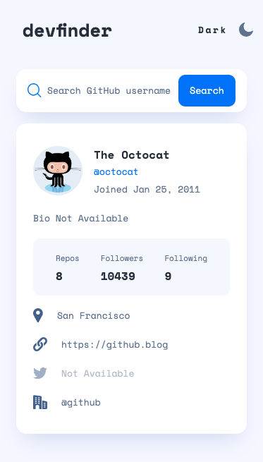
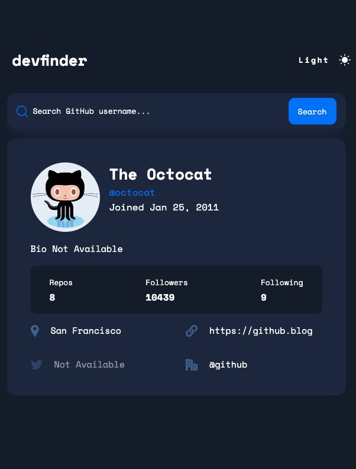
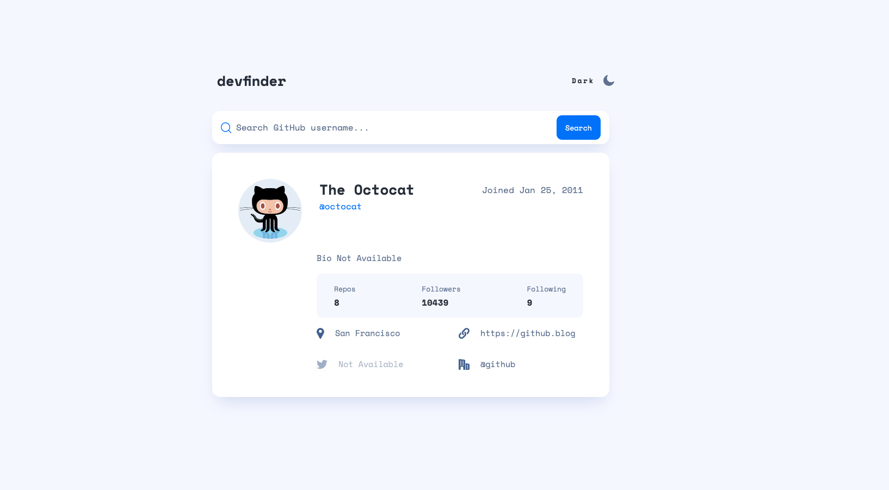

# GitHub user search app

This is my solution to the [GitHub user search app challenge on Frontend Mentor](https://www.frontendmentor.io/challenges/github-user-search-app-Q09YOgaH6).

## Table of contents

- [Overview](#overview)
  - [The challenge](#the-challenge)
  - [Screenshot](#screenshot)
  - [Links](#links)
- [My process](#my-process)
  - [Built with](#built-with)
  - [What I learned](#what-i-learned)
  - [Continued development](#continued-development)
  - [Useful resources](#useful-resources)
- [Author](#author)

## Overview

### The challenge

Users should be able to:

- View the optimal layout for the app depending on their device's screen size
- See hover states for all interactive elements on the page
- Search for GitHub users by their username
- See relevant user information based on their search
- Switch between light and dark themes
- **Bonus**: Have the correct color scheme chosen for them based on their computer preferences. _Hint_: Research `prefers-color-scheme` in CSS.

### Screenshot





### Links

- Solution URL: [https://github.com/kateneilsen/github-user-search-svelte](https://github.com/kateneilsen/github-user-search-svelte)
- Live Site URL: [https://github-user-search-svelte.vercel.app/](https://github-user-search-svelte.vercel.app/)

## My process

### Built with

- [Svelte](https://svelte.dev/) - JS Framework
- JavaScript
- Mobile-first workflow

### What I learned

This is my first project using the svelte framework.
**Key Takeaways:**
- svelte has two-way data binding!
- create custom events using the `createEventDispatcher` utility. This allows you to bubble up an event to the parent component.
- component scoped styles (did not utilize this but plan to in the future)

**Search.svelte**

```javascript
import { createEventDispatcher } from "svelte";
const dispatch = createEventDispatcher();
<button
  class="search-button"
  on:click={() => dispatch("filter", searchFilter)}
  on:keydown={() => dispatch("filter", searchFilter)}
>
  Search
</button>;
```

**App.svelte**:

```javascript
  const getUser = async () => {
    if (searchFilter === "") {
      const data = await fetch(`${base_url}/octocat`);
      const result = await data.json();
      user = result;
    } else {
      const data = await fetch(`${base_url}/${searchFilter}`);
      if (data.status === 404) {
        searchError = true;
        searchFilter = "";
      } else {
        searchError = false;
        const result = await data.json();
        user = result;
      }
    }
  };
  <Search
    {isDarkMode}
    bind:searchFilter
    on:filter={() => getUser()}
    {searchError}
  />
```

### Continued development

- local storage
- Svelte stores
- accessibility in svelte

### Useful resources

- [Custom Svelte Store](https://maximmaeder.com/custom-store-for-svelte/) - This helped me with understanding custom stores in svelte and working with the css 'prefers-color-scheme'.
- [MDN: Svelte](https://developer.mozilla.org/en-US/docs/Learn/Tools_and_testing/Client-side_JavaScript_frameworks/Svelte_getting_started) - This is my first project using svelte. I used this article to help me learn the basics and apply them to this project.

## Author

- GitHub - [@kateneilsen](https://www.github.com/kateneilsen)
- Frontend Mentor - [@kateneilsen](https://www.frontendmentor.io/profile/kateneilsen)
